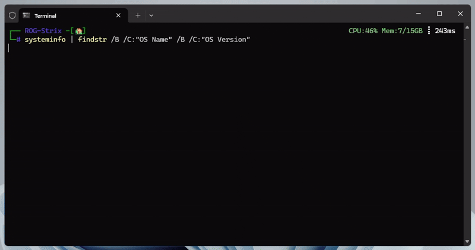

# Linux 💘 Windows


**LinuxLoveWindows** is a PowerShell module that helps you save and load commands from your Windows Subsystem for Linux (WSL) environment into your PowerShell session.

## Features

- Imports Linux commands into PowerShell.
- Loads previously saved Linux commands automatically on module import.

## Demo


📽️[Open YouTube to watch the full demo in Bahasa Indonesia](https://www.youtube.com/watch?v=tZlmCbHwXfg)

## Requirements

- Windows with WSL installed.
- PowerShell 6.0 or newer.
- [`WslInterop`](https://www.powershellgallery.com/packages/WslInterop) PowerShell module installed.

## Installation

Use this command
   ```powershell
   Install-Module -Name LinuxLoveWindows
   ```

or download this repository to PowerShell module location (e.g., `C:\Program Files\PowerShell\6\Modules\`).

## Usage

1. Open PowerShell.
2. Edit your PowerShell profile by running:
   ```powershell
   notepad $Profile
   ```
3. Add the following line:
   ```powershell
   Import-Module LinuxLoveWindows
   ```
4. Save and close the profile file.
5. Restart PowerShell, then call the function:
   ```powershell
   Import-Linux
   ```

This function will retrieve a list of commands from Linux, filter them, and import each command into your PowerShell session.

## Note

- Ensure your WSL environment is properly set up and accessible from PowerShell.
- To remove a command from autoload, manually delete it from the `imported_linux_commands.txt` in your Windows user home directory.
